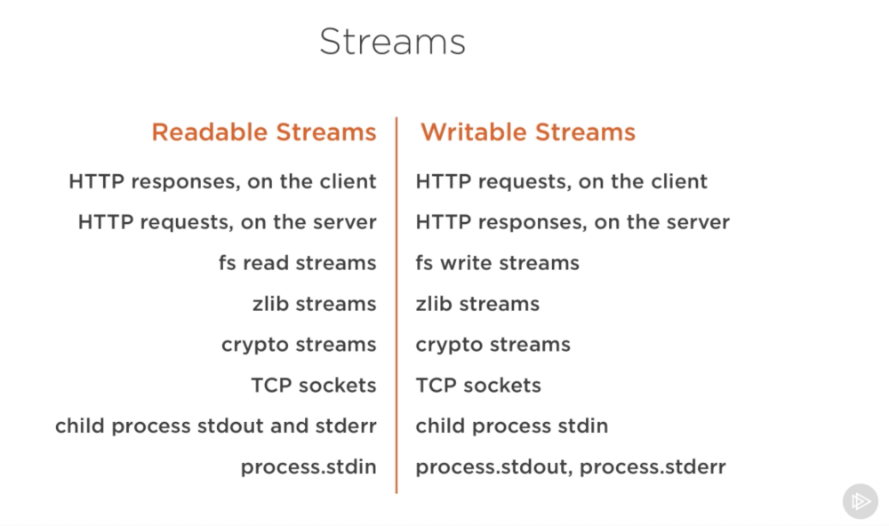

export {default as theme} from './theme'
import { Head, Appear, Image } from 'mdx-deck'
import { Split } from 'mdx-deck/layouts'
import {Box} from 'grid-styled' 


# Stream in node.js 

Node Sydney October 2018 

---

# who am i ?

- Ashwin Kandel (@incessantmeraki)
- Works at Quantium
- Works with Node.js, React, & AWS

---

# What is node.js ?

 Node.js® is a JavaScript runtime built on Chrome's V8 JavaScript engine.

---

# What actually is node.js ?

I/O interface

---
# What does that mean ?

Helps write program in JavaScript that talks to 

<ul>
  <Appear>
    <li> Network </li>
    <li> File System </li>
    <li> other I/O </li>
  </Appear>
</ul>

---

export default Split


# I/O sources

<ul>
  <Appear>
    <li> Databases (MySQL, Redis, CouchDB...) </li>
    <li> APIs (Facebook, Twitter, Youtube ...) </li>
    <li> HTTP/WebSocket connections </li>
    <li> Files </li> 
  </Appear>
</ul>

---
# Comon thing for all I/O ?

<Appear>
  <h2 style={{color: 'red'}}> Data </h2>
</Appear>

---

# 🤔

<Appear>
  <h2> If it is all about data, then   </h2>
  <h2> There must be some good way to handle data  </h2>
</Appear>

---

## This is where 👉	Stream 👈	 comes into the picture

---

# What is Stream ?

## Stream is a handy abstraction that's there in node.js to manipulate data

---

# Is Stream a new concept ? 
<Appear>
  <h2> No it isn't </h2>
</Appear>

---
##  Been there since the days of UNIX in form of pipe

<br/> 

```sh
  $ cat file | wc -c
```

---

# Why Streams ?

<ul>
  <Appear>
    <li><h2>Handling large amount of data in limited resource </h2> </li>
    <li><h2>Compose decoupled applications using generic abstraction</h2> </li>
  </Appear>
</ul>


---

# Demo 1: Handling large amount of data

---

## Types of Stream

- Readable : produces data  
- Writable : consumes data
- Transform : consumes data , modifies it, and produces the modified thing
- Duplex : produces and consumes data separately. Similar to telephone

---

## Pipe

used to connect different streams

- Readable: readable.pipe(X)
- Writeable: X.pipe(writeable)
- Transform: X.pipe(transform).pipe(Y)
- Duplex: X.pipe(duplex).pipe(X)

---

## Common Readable Stream Methods

- stream.on('readable', callback)
- stream.on('end' ,callback)
- stream.on('data', callback)
- stream.read()
- stream.pipe(writeableStream)
- stream.pipe(x)


---

## Flow mode v/s Pull mode

- Two types of mode readable stream operates 
- Difference ? Backpressure
   If receiving end can't handle the pace of sender, data clogs up
- Default : pull based mode 
- Use stream.resume() or stream.on('data, callback) to enable flow mode
- Suggestion: use .pipe() 

---

## Common Writeable Stream Methods

- stream.write(data)
- stream.on('finish', callback)
- stream.end(), stream.end(data)
- x.pipe(stream)

---

## Demo 2 : Exploring common methods available

---

## Core built-in streams



---

## Examples:


## HTTP 

---

## Zlib

---

## Crypto

---

## TCP

---

## Split

---

## Creating streams

---

## to2

---

## from2

---

## through2

---

## duplexify 

---

## pumpify

---

Code example

```js
var through2 = require('through2')

var transformer = through2(function (chunk, enc, next) {
  next(chunk.toUpperCase())
})

```
